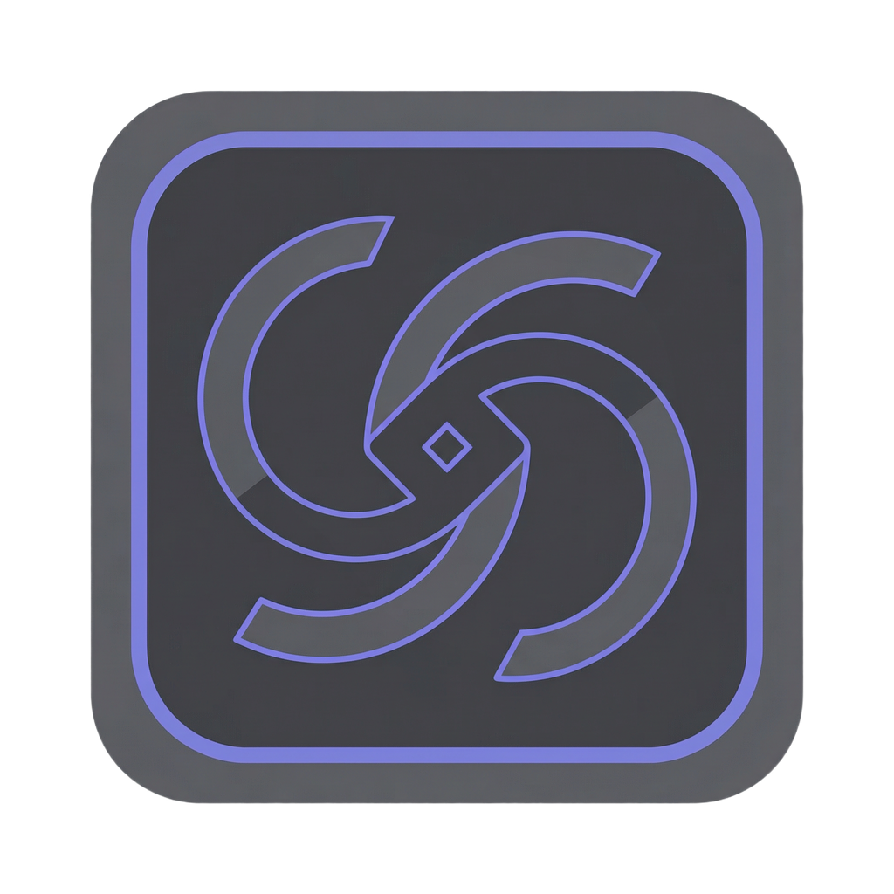
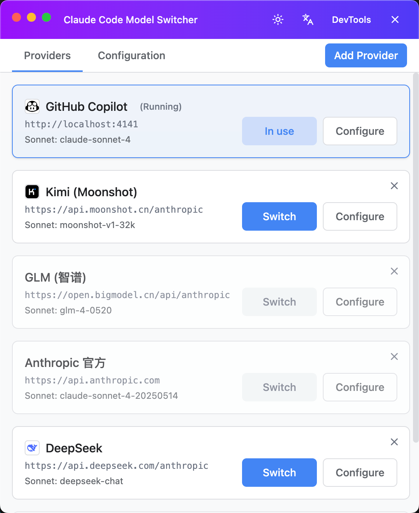
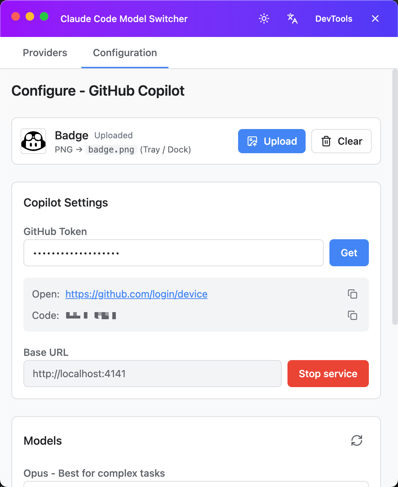
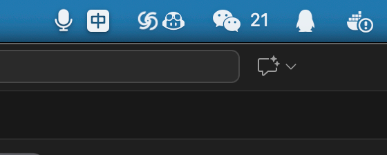
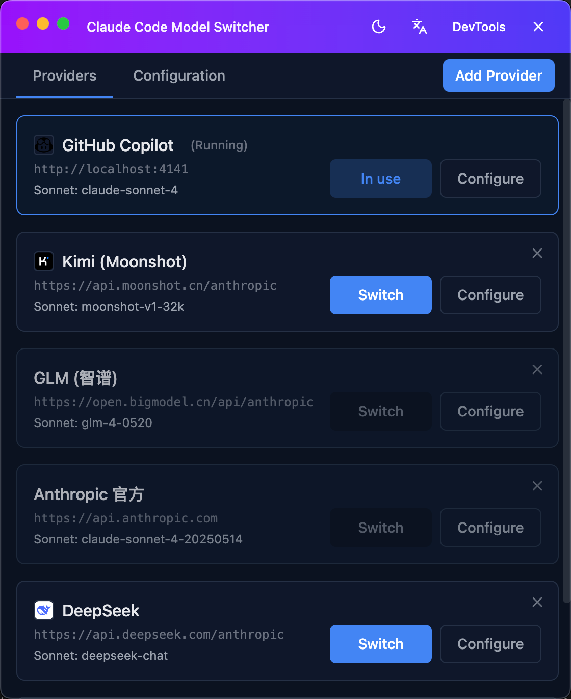

# Claude Code Model Switcher

<div align="center">




An Electron tray app for quickly switching Claude Code model/provider configurations.

[中文 README](README.md)

[Features](#features) •
[Install](#install) •
[CLI](#cli) •
[Development](#development)

</div>

---

## Screenshots

### Main



### Configuration



### Tray



### Dark mode



## Features

### One-click provider switching

- Switch providers from the tray menu (Kimi, GLM, Anthropic, DeepSeek, Copilot)
- Automatically updates `~/.claude/settings.json`
- Backs up and clears session cache when switching
- Tray icon reflects the active provider

### Flexible model configuration

- Configure four roles: **Opus**, **Sonnet**, **Haiku**, **Subagent**
- Fetches the latest model list from each provider API
- Pick from a dropdown or manually enter model IDs
- Per-provider configs with presets

### Secure credentials

- Encrypted storage for provider API tokens
- Configurable Base URL and timeout
- Built-in connection test

### Copilot integration

- One-click install for `copilot-api`
- Start/stop the proxy service with status checks
- GitHub OAuth device flow
- Token management and status display

---

## Supported providers

| Provider      | Name            | Base URL                                 | Notes                   |
| ------------- | --------------- | ---------------------------------------- | ----------------------- |
| **Kimi K2**   | Moonshot AI     | `https://api.moonshot.cn/anthropic`      | Long context            |
| **GLM**       | Zhipu AI        | `https://open.bigmodel.cn/api/anthropic` | Fast in China           |
| **Anthropic** | Claude official | `https://api.anthropic.com`              | Native                  |
| **DeepSeek**  | DeepSeek V3     | `https://api.deepseek.com/anthropic`     | Cost-effective          |
| **Copilot**   | GitHub Copilot  | `http://localhost:4141`                  | Via `copilot-api` proxy |

---

## Install

### Desktop app

Download installers from the Releases page:

- macOS: `.dmg`
- Windows: `.exe`
- Linux: `.AppImage` / `.deb`

### First run

1. Start the app and find it in the system tray.
2. Add a provider: "Manage Providers" → "Add Provider".
3. Configure credentials:
   - Provider ID (e.g. `kimi`)
   - API Token
   - Base URL (the app will append `/anthropic` when applicable)
4. Fetch models from API.
5. Select models for Opus/Sonnet/Haiku/Subagent.
6. Save and switch providers from the tray menu.

### Daily usage

- Quick switch: Tray menu → select provider
- Edit config: Manage Providers → select provider → configure
- Edit script: click "Edit script" to adjust model fetch logic

---

## CLI

A CLI for server/headless environments. It shares the same config with the desktop app.

### Install

```bash
# Option 1: global install
npm install -g cc-model-switcher

# Option 2: from source
git clone git@github.com:rasenjs/ccms.git cc-model-switcher
cd cc-model-switcher
npm install
npm run build:cli
npm link
```

### Commands

```bash
# Help
ccms help

# List providers
ccms list
# or
ccms ls

# Switch provider
ccms switch <provider-id>

# Show current config
ccms current
# or
ccms show
```

---

## Development

### Requirements

- Node.js >= 20
- npm >= 9

### Setup

```bash
git clone git@github.com:rasenjs/ccms.git cc-model-switcher
cd cc-model-switcher
npm install
```

### Dev mode

```bash
npm run dev
npm run dev:main
npm run dev:renderer
```

Renderer dev server: `http://localhost:9527`

### Build

```bash
npm run build
npm run build:main
npm run build:renderer
npm run build:cli
npm run typecheck
npm run lint
```

### Package

```bash
npm run package
npm run package -- --mac
npm run package -- --win
npm run package -- --linux
```

Build outputs:

- Compiled output: `dist/`
- electron-builder packages: `release/`
